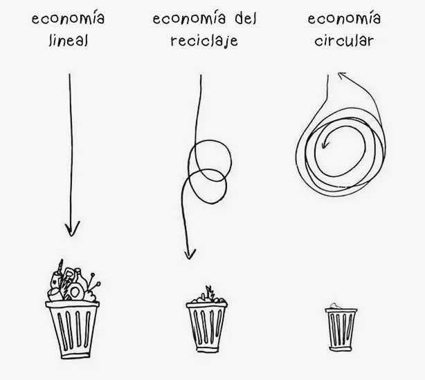

\newpage

# Contexto de la Crísis Climática y Decrecimiento

La crisis climática y la emergencia medioambiental ponen de manifiesto la necesidad de desarrollar medidas que aboguen por el desarrollo sostenible del planeta. La Economía Circular se posiciona como un modelo responsable con el medio y con la perdurabilidad de los recursos.

Dentro del movimiento de Teachers for Future, y en el ámbito de la Economía Circular, a lo largo del curso se realizarán actividades cuyos valores pongan el foco en la necesidad de un cambio de modelo ecónomico, así como brindar al alumnado la posibilidad de realizarlo utilizando herramientas libres.

En Formación Profesional deben impulsarse planes de actuación adaptados a las características y necesidades de cada familia profesional, vinculando la
problemática medioambiental con su saber práctico y laboral. Ello, proporcionará instrumentos reflexivos y aplicados que actividad profesional en el largo plazo.

Se puede leer más detalladamente el artículo aquí:

[Revista Comunicar - Economia Circular](https://www.revistacomunicar.com/index.php?contenido=detalles&numero=73&articulo=73-2022-02])

\

